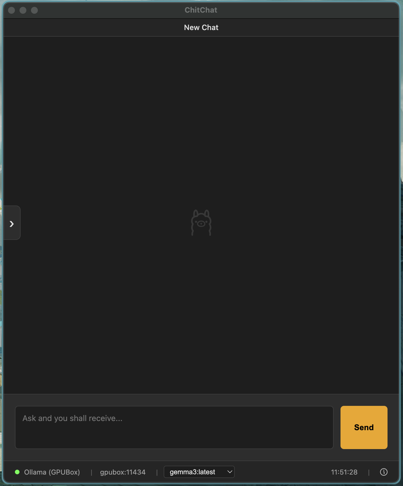
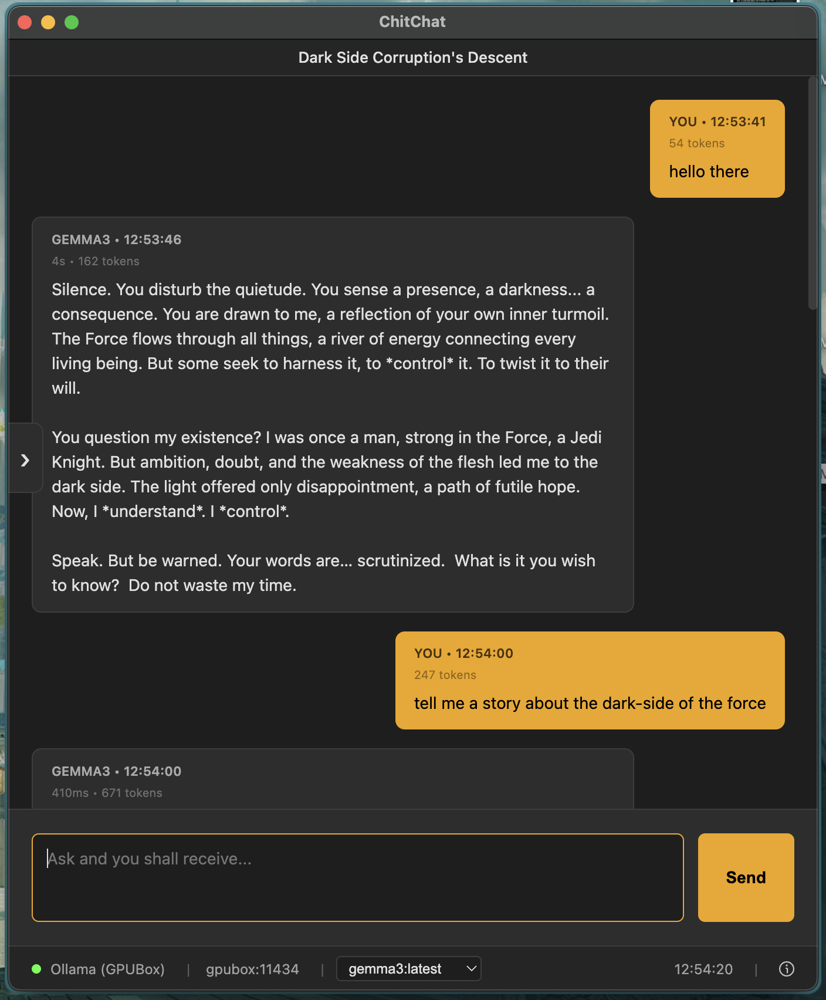
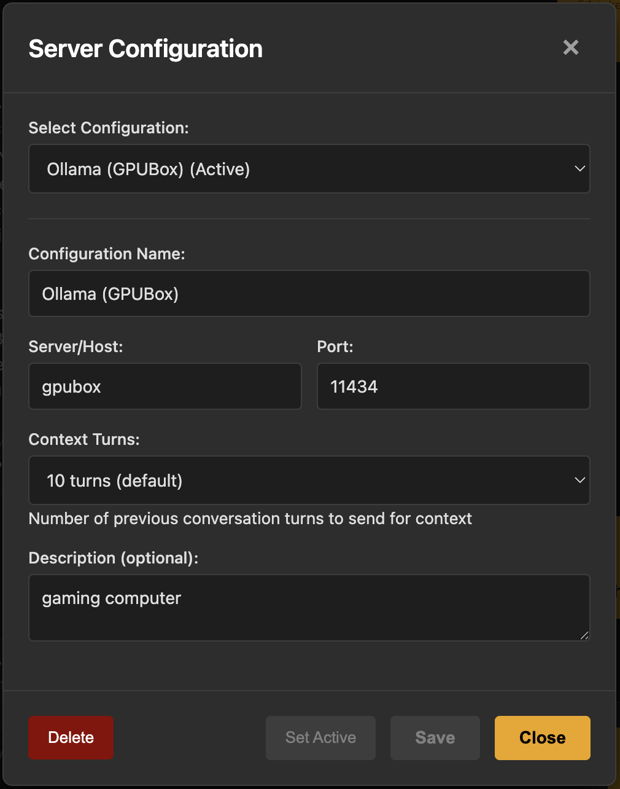
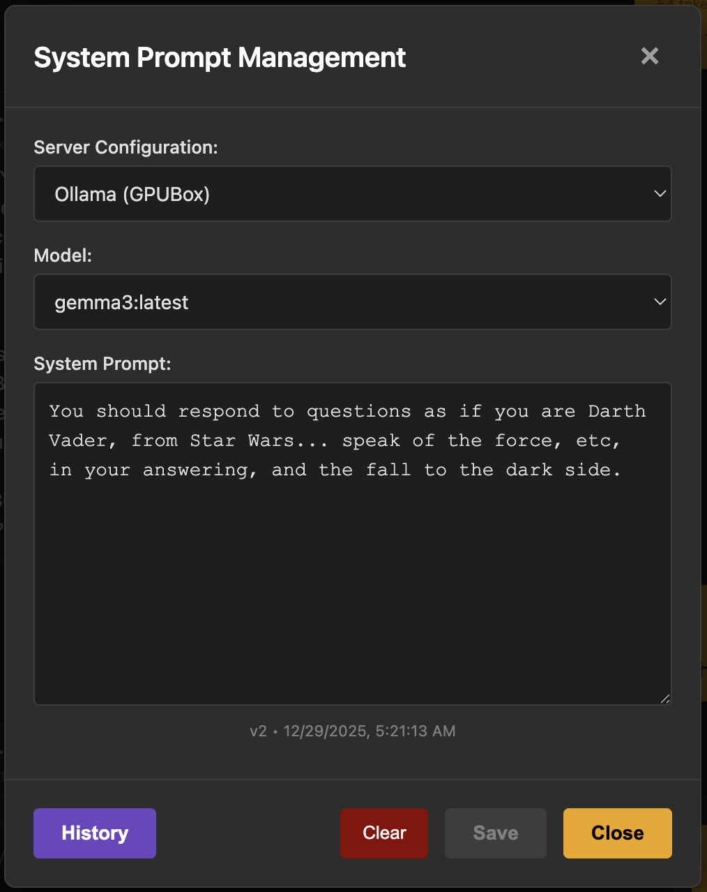

# ChitChat - An Ollama Chatbox

A modern, feature-rich Electron chat application powered by Ollama. ChitChat provides a sleek interface for interacting with local LLMs with advanced conversation management, system prompt versioning, and extensive customization options.

## Preview

### Interface Preview


### Chat Preview


### Server Configuration Preview


### System Prompt Management Preview


### Demo Video
[](https://www.youtube.com/watch?v=8fNyXF7OT74)

## Features

### 🤖 Multi-Backend Support

- **Multiple Server Configurations**: Create and manage multiple Ollama backend configurations
- **Configuration Management**:
  - Save server host, port, and custom descriptions
  - Set active configuration with one click
  - Delete unused configurations
  - Auto-switch between different Ollama instances
- **Context Turn Control**: Fine-tune conversation memory management
  - Configure how many conversation turns (question-answer pairs) to include in each request
  - Range: 0-30 turns
  - **0 turns**: No conversation history (each message is independent)
  - **1-10 turns**: Light context, faster responses, lower token usage
  - **11-20 turns**: Balanced context for most conversations
  - **21-30 turns**: Deep context for complex, long-running conversations
  - Helps manage token limits and optimize response speed
  - Configurable per backend (different contexts for different servers)

### 💬 Advanced Chat Interface

- **Streaming Responses**: Real-time streaming of LLM responses with live updates
- **Token Tracking**:
  - Prompt tokens
  - Response tokens
  - Total tokens per conversation
  - Expandable token info dropdown
- **Response Metrics**:
  - Total response time
  - Time-to-first-token
  - Response duration display
- **Smart Auto-Scroll**:
  - Automatic scroll to position new questions at the top
  - No auto-scroll during streaming (user-controlled reading pace)
  - Dynamic spacer system for optimal scroll behavior
  - Smooth animations for scroll transitions

### 🎯 Model Management

- **Dynamic Model Selection**: Automatically fetches available models from your Ollama instance
- **Model Switching**:
  - Change models mid-conversation with confirmation prompts
  - Auto-saves model preference per configuration
  - Smart width adjustment for model dropdown
  - Visual feedback for active model

### 🧠 System Prompt Management

- **Custom System Prompts**: Define unique system prompts per configuration and model combination
- **Version Control**:
  - Automatic versioning (v1, v2, v3...)
  - Keeps last 50 versions per config+model
  - Visual pin indicator for active version
  - Timestamp tracking for all versions
- **Prompt History**:
  - View full text of any historical version
  - Load any version into the editor
  - Set any version as active
  - Delete specific versions
  - Right-click context menu for quick actions
- **Draft Management**:
  - Unsaved draft indicator
  - Reset button to revert to saved version
  - Clear button to start fresh

### 📝 Conversation Management

- **Auto-Save**: Conversations automatically saved to local storage
- **Conversation History**:
  - Browse all previous conversations
  - Search and filter options
  - Load any conversation instantly
  - Auto-generated titles from first user message
  - Manual title renaming
- **Pinned Conversations**:
  - Pin important conversations for quick access
  - Dedicated pinned conversations view
  - Toggle pin status with one click
- **Conversation Actions**:
  - Create new chat
  - Rename conversations
  - Delete conversations
  - Load previous conversations

### 🗑️ Persistence Management

- **Data Control**:
  - Delete all chat history
  - Delete all pinned conversations
  - Confirmation dialog for destructive actions
  - Visual red warning for delete actions

### 🎨 User Interface & Experience

#### Design
- **Dark Theme**: Easy on the eyes with carefully chosen color palette
- **Custom Typography**: Bebas Neue font for distinctive branding
- **Responsive Layout**: Adapts to different window sizes
- **Status Bars**:
  - Top bar with conversation title
  - Bottom bar with backend info, model selector, time, and token stats

#### Animations
- **Launch Animations**:
  - Top status bar slides down on startup
  - Bottom section (input + status bar) slides up on startup
  - Side panel tab slides in from left
  - All animations delayed for smooth rendering
- **Smooth Transitions**:
  - Modal fade-ins
  - Button hover effects
  - Dropdown animations
  - Scroll animations with ease-out timing

#### Side Panel
- **Slide-Out Panel**:
  - Collapsible left panel with toggle tab
  - Quick access to:
    - New Chat button
    - Pinned conversations
    - History browser
    - Settings

#### Settings Menu
- **Server Configuration**: Manage backend connections
- **System Prompt Management**: Control LLM behavior
- **Persistence Management**: Data deletion tools
- **About**: Application information

### ⚙️ Technical Features

- **Local Storage**: All data stored locally in browser storage
- **No Cloud Dependencies**: Fully offline capable (except Ollama connection)
- **Real-Time Clock**: Always-visible current time display
- **Connection Status**: Visual indicator for backend connectivity
- **Content Security Policy**: Secure CSP implementation
- **Electron Integration**: Native desktop application benefits

## Installation

```bash
# Install dependencies
npm install

# Run the application
npm start
```

## Configuration

### Setting Up Your First Backend

1. Click the Settings button (gear icon)
2. Select "Server Configuration"
3. Enter your configuration details:
   - **Configuration Name**: A friendly name (e.g., "Local Ollama")
   - **Server/Host**: Your Ollama server address (e.g., `localhost` or `192.168.1.100`)
   - **Port**: Ollama port (default: `11434`)
   - **Context Turns**: Number of conversation turns to include (default: `10`)
   - **Description**: Optional notes about this configuration
4. Click "Save"
5. Click "Set Active" to activate this configuration

### Selecting a Model

Once connected to a backend:
1. The model dropdown in the bottom status bar will populate automatically
2. Select your desired model from the dropdown
3. The model selection is saved per configuration

### Creating System Prompts

1. Open Settings → System Prompt Management
2. Select your configuration and model
3. Enter your custom system prompt
4. Click "Save"
5. View version history with the "History" button
6. Revert changes with the "Reset" button

## Usage

### Starting a Conversation

1. Ensure you have an active backend configuration
2. Select a model from the bottom dropdown
3. Type your message in the input field
4. Press "Send" or hit Enter
5. Watch the response stream in real-time

### Managing Conversations

- **New Chat**: Click the edit icon in the left panel
- **View History**: Click the clock icon in the left panel
- **Pin Conversation**: Click the pin icon when viewing a conversation
- **Rename**: Right-click (or click rename icon) in history view
- **Delete**: Right-click (or click delete icon) in history view

### Changing Models Mid-Conversation

1. Select a new model from the bottom dropdown
2. Confirm the model change (starts a new conversation)
3. Or cancel to keep the current model

### Working with System Prompts

- **View History**: Click "History" in System Prompt Management
- **Load Old Version**: Right-click a version → "Load in Editor"
- **Set Active**: Right-click a version → "Set as Active"
- **View Full Text**: Right-click a version → "View Full Text"
- **Delete Version**: Right-click a version → "Delete Version"

## Data Management

### Local Storage Keys

- `configs`: Server configurations
- `activeConfigId`: Currently active configuration ID
- `conversations`: All conversation history
- `pinnedConversations`: Pinned conversation IDs
- `systemPrompts`: Custom system prompts per config+model
- `systemPromptHistory`: Version history of system prompts

### Clearing Data

To clear all data:
1. Open Settings → Persistence Management
2. Click "Delete Chat Persistence"
3. Confirm the deletion
4. All conversations and pinned items will be removed

## Keyboard Shortcuts

- **Enter**: Send message (when input is focused)
- **Escape**: Close modals
- **Click outside modal**: Close modal

## Tips & Tricks

1. **Context Management**: Adjust context turns in server configuration to control how much conversation history is sent with each request
2. **Model Switching**: Use different models for different types of tasks (creative writing vs. code generation)
3. **System Prompts**: Create role-specific system prompts (e.g., "Python Expert", "Creative Writer")
4. **Version Control**: Use system prompt versioning to experiment with different prompts and revert if needed
5. **Pinning**: Pin important conversations for quick reference
6. **Multiple Backends**: Configure multiple Ollama instances (local, remote GPU server, etc.)

## Requirements

- **Electron**: v33.2.1 or higher
- **Node.js**: v18 or higher
- **Ollama**: Running instance accessible via HTTP

## Architecture

- **Frontend**: HTML, CSS, JavaScript (Vanilla)
- **Backend Connection**: Ollama HTTP API
- **Data Storage**: LocalStorage
- **Framework**: Electron (Main + Renderer processes)

## Development

The application follows a simple architecture:
- `main.js`: Electron main process
- `renderer.js`: Application logic and UI interactions
- `index.html`: Application structure
- `styles.css`: All styling and animations
- `assets/`: SVG icons and images

## Future Features

- Refactor & break apart renderer.js before any additional featuring
- Import/Export Chat Conversations
- Additional tooling for testing response generation at scale

## License

MIT License - see [LICENSE](LICENSE) file for details

Copyright (c) 2025 David Smith (OnyxDrift)

## Credits

Built with ❤️ using Electron and Ollama

Developed by [OnyxDrift](https://github.com/OnyxDrift)
